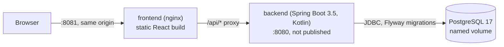
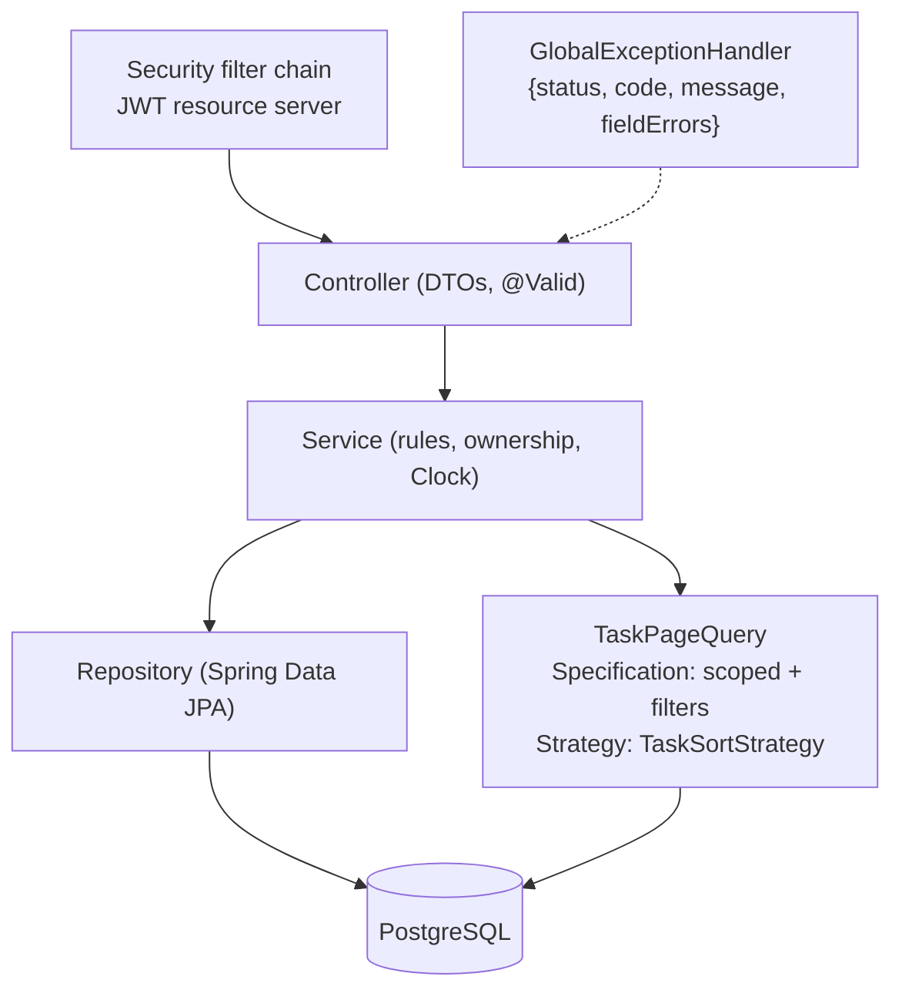
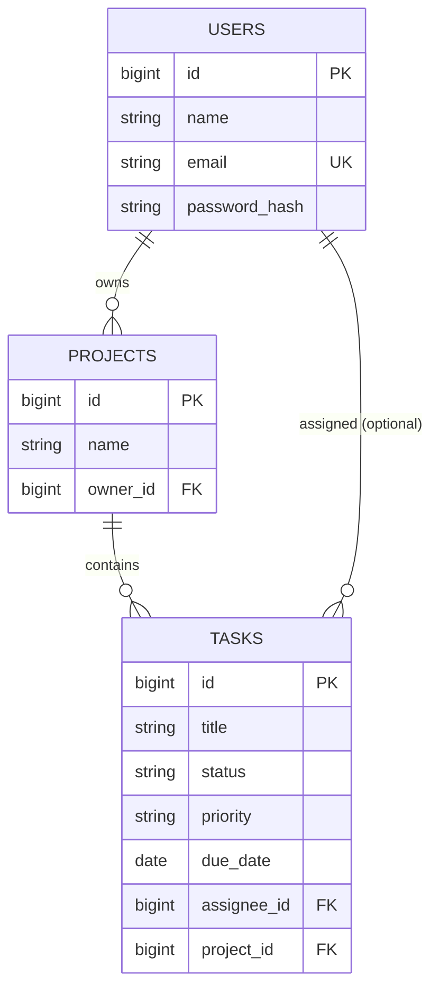
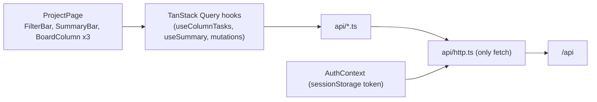
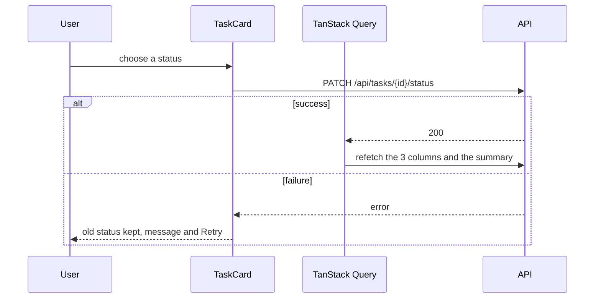

# Diagrams
Mermaid; GitHub renders them. Kept in sync with `docs/architecture.md`.

## System (Compose)

```mermaid
flowchart LR
  Browser -->|":8081, same origin"| Nginx["frontend (nginx)\nstatic React build"]
  Nginx -->|"/api/* proxy"| API["backend (Spring Boot 3.5, Kotlin)\n:8080, not published"]
  API -->|JDBC, Flyway migrations| DB[("PostgreSQL 17\nnamed volume")]
```

## Backend layers and patterns

```mermaid
flowchart TB
  C["Controller (DTOs, @Valid)"] --> S["Service (rules, ownership, Clock)"]
  S --> R["Repository (Spring Data JPA)"]
  S --> Q["TaskPageQuery\nSpecification: scoped + filters\nStrategy: TaskSortStrategy"]
  R --> DB[(PostgreSQL)]
  Q --> DB
  SEC["Security filter chain\nJWT resource server"] --> C
  EX["GlobalExceptionHandler\n{status, code, message, fieldErrors}"] -.-> C
```

## Data model

```mermaid
erDiagram
  USERS ||--o{ PROJECTS : owns
  PROJECTS ||--o{ TASKS : contains
  USERS ||--o{ TASKS : "assigned (optional)"
  USERS { bigint id PK
    string name
    string email UK
    string password_hash }
  PROJECTS { bigint id PK
    string name
    bigint owner_id FK }
  TASKS { bigint id PK
    string title
    string status
    string priority
    date due_date
    bigint assignee_id FK
    bigint project_id FK }
```

## Frontend data flow

```mermaid
flowchart LR
  Page["ProjectPage\nFilterBar, SummaryBar, BoardColumn x3"] --> Hooks["TanStack Query hooks\n(useColumnTasks, useSummary, mutations)"]
  Hooks --> Api["api/*.ts"] --> Http["api/http.ts (only fetch)"] --> Nginx["/api"]
  Auth["AuthContext (sessionStorage token)"] --> Http
```

## Status change

```mermaid
sequenceDiagram
  participant U as User
  participant C as TaskCard
  participant Q as TanStack Query
  participant A as API
  U->>C: choose a status
  C->>A: PATCH /api/tasks/{id}/status
  alt success
    A-->>Q: 200
    Q->>A: refetch the 3 columns and the summary
  else failure
    A-->>C: error
    C-->>U: old status kept, message and Retry
  end
```
